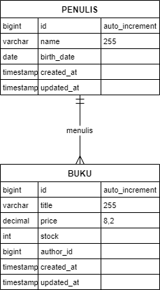

# Aplikasi Manajemen Penulis dan Buku Laravel 8

Aplikasi ini dapat mengelola penulis dan buku-buku mereka. Aplikasi ini menyediakan panel admin untuk membuat, membaca, memperbarui, dan menghapus penulis dan buku. Aplikasi ini juga menyertakan API untuk berinteraksi dengan data.

## Desain Database

Database terdiri dari dua tabel utama:

### Tabel Penulis
* id (integer, primary key, auto-increment)
* nama (string)
* bio (text)
* tanggal_lahir (date)
* created_at (timestamp)
* updated_at (timestamp)

### Tabel Buku
* id (integer, primary key, auto-increment)  
* judul (string)
* id_penulis (integer, foreign key yang mereferensi penulis.id)
* isbn (string)
* tahun_terbit (integer)
* deskripsi (text)
* created_at (timestamp)
* updated_at (timestamp)

## API Endpoints

API menyediakan endpoint berikut:

### Auth
- POST /api/login
- POST /api/register
- POST /api/logout

### Penulis
- GET /api/authors
- GET /api/authors/{id}
- POST /api/authors
- PUT /api/authors/{id}
- DELETE /api/authors/{id}

### Buku
- GET /api/books
- GET /api/books/{id}
- POST /api/books
- PUT /api/books/{id}
- DELETE /api/books/{id}

## Panel Admin

Panel admin menyediakan antarmuka untuk mengelola penulis dan buku:

- Dashboard
- Manajemen Penulis (CRUD)
- Manajemen Buku (CRUD)

## Ketergantungan (Dependencies)

Proyek ini menggunakan dependensi berikut:

* **PHP:** ^7.3|^8.0
* **Laravel Framework:** ^8.75
* **fruitcake/laravel-cors:** ^2.0
* **guzzlehttp/guzzle:** ^7.0.1
* **laravel/sanctum:** ^2.11
* **laravel/tinker:** ^2.5
* **facade/ignition:** ^2.5 (untuk development)
* **fakerphp/faker:** ^1.9.1 (untuk development)
* **laravel/sail:** ^1.0.1 (untuk development)
* **mockery/mockery:** ^1.4.4 (untuk testing)
* **nunomaduro/collision:** ^5.10 (untuk development)
* **phpunit/phpunit:** ^9.5.10 (untuk testing)

## Petunjuk Instalasi

1. Kloning repositori: `git clone [URL repositori]`
2. Instal dependensi Composer: `composer install`
3. Buat salinan file `.env.example` dan ganti namanya menjadi `.env`. Sesuaikan pengaturan database di file `.env`.
4. Generate application key: `php artisan key:generate`
5. Jalankan migrasi database: `php artisan migrate`
6. (Opsional) Jalankan seeder database: `php artisan db:seed`
7. Jalankan aplikasi: `php artisan serve`

## Informasi Tambahan

* Aplikasi ini menggunakan sistem otentikasi bawaan Laravel.
* API didokumentasikan menggunakan [alat dokumentasi API, jika ada].
* Panel admin dapat diakses di `/admin`.
